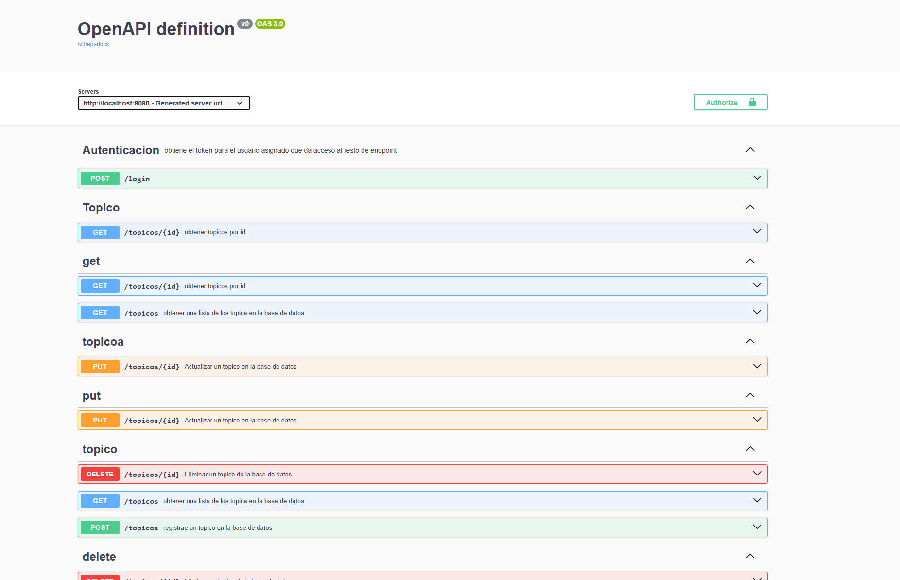

## API FORO HUB, para  solicitudes REST:
* Iniciar Sesion
* Registrar un topico
* Actualizar un Topico
* Eliminar un topico
* Listar topicos

##  Autorización y auntenticacion
La API requiere autorización mediante tokens JWT para acceder a ciertas funciones.

## Donde se despliega
La API se despliega localmente en:
* Base URL: http://localhost:8080
* Y http://localhost:8080/swagger-ui/index.html
* Y si no te gusta vete a usar insonmia o postmand

## Tecnologías Usadas
- Maven 
- Spring Boot 
- Java jdx 22
- Spring Data JPA 
- MySQL 
- JWT (JSON Web Tokens) 
- Spring Security
- Lombock

### Autenticación (`autenticacion-controller`)
- **Iniciar sesión (login)**
    - `POST /login`
    - Body: `DatosAutenticacionUsuario`
    - Respuesta: `DatosJWTtoken`

##  Puntos de acceso
### topicos (`TopicoController`)

- **Actualizar un tópico**
  - `PUT /topico/{id}`
  - Body: `DatosActualizarTopico`

- **Crear un nuevo tópico**
  - `POST /topico`
  - Body: `DatosRegistroTopico`

- **Listar todos los tópicos**
  - `GET /topico`
  - Respuesta: `List<PageDatosListadoTopico>`

- **Listar un topico por "ID"**
  - `GET /topico/{id}`
  - Respuesta: `PageDatosListadoTopico`

- **Eliminar un tópico (lógico)**
  - `DELETE /topico/{id}`

Aun faltan por agregar muchas cosas, como las respuestas, incluso se podria hacer que cada curso sea una entidad que puede tener infinitud de topicos, pero sera para otra ocasion, gracias por ver este proyecto.

## Imagenes

